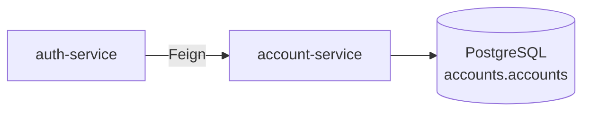
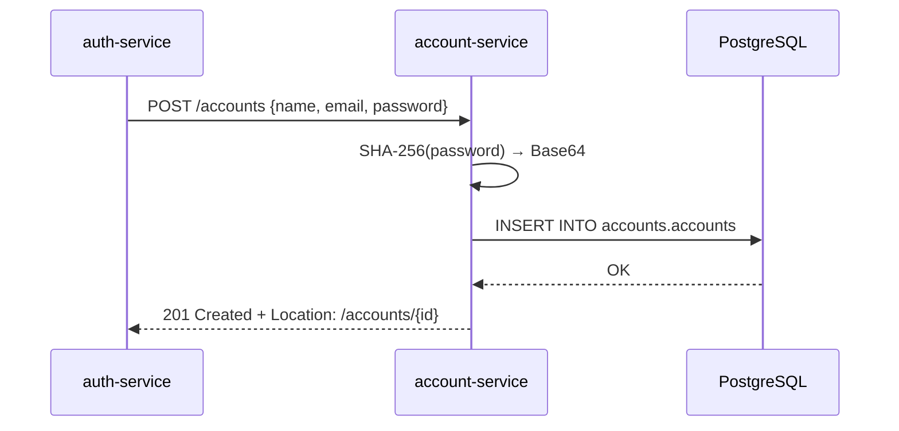

# pma.261.account-service

Runnable Spring Boot microservice that manages user accounts. It implements the `AccountController` interface from the `account` library and persists data in PostgreSQL via JPA + Flyway.

## Overview

`account-service` is the single source of truth for account data. It stores credentials as SHA-256 hashes and never exposes passwords in responses. Other services communicate with it exclusively through the `account` Feign client library.



### Account creation flow



## Stack

| Layer | Technology |
|---|---|
| Language | Java 25 |
| Framework | Spring Boot 4.x + Spring Data JPA |
| Database | PostgreSQL |
| Migrations | Flyway |
| Utilities | Lombok |

## Endpoints

All routes are prefixed with `/accounts`. The service listens on port `8080`.

| Method | Path | Description | Response |
|---|---|---|---|
| `POST` | `/accounts` | Create a new account | `201 Created` + `Location` header |
| `DELETE` | `/accounts/{id}` | Delete an account | `204 No Content` |
| `GET` | `/accounts` | List all accounts | `200 OK` + `AccountOut[]` |
| `GET` | `/accounts/{id}` | Get account by ID | `200 OK` + `AccountOut` |
| `POST` | `/accounts/login` | Find by email + password | `200 OK` + `AccountOut` |
| `GET` | `/accounts/health-check` | Liveness probe | `200 OK` |

## Database Schema

Managed by Flyway. Migrations run automatically on startup.

```sql
-- Schema
CREATE SCHEMA IF NOT EXISTS accounts;

-- Table
CREATE TABLE accounts.accounts (
    id              VARCHAR(36)  PRIMARY KEY,   -- UUID generated by JPA
    name            VARCHAR(256) NOT NULL,
    email           VARCHAR(256) NOT NULL UNIQUE,
    password_sha256 VARCHAR(64)  NOT NULL
);

-- Index for login lookups
CREATE INDEX idx_email_sha256 ON accounts (email, password_sha256);
```

### Password hashing

Passwords are never stored in plain text. On creation and on login the service computes `SHA-256(password)` encoded as Base64 and stores/queries that value.

## Environment Variables

| Variable | Description |
|---|---|
| `DATABASE_HOST` | PostgreSQL hostname |
| `DATABASE_PORT` | PostgreSQL port (typically `5432`) |
| `DATABASE_DB` | Database name |
| `DATABASE_USERNAME` | Database user |
| `DATABASE_PASSWORD` | Database password |

## Configuration (`application.yaml`)

```yaml
server:
  port: 8080

spring:
  datasource:
    url: jdbc:postgresql://${DATABASE_HOST}:${DATABASE_PORT}/${DATABASE_DB}
    username: ${DATABASE_USERNAME}
    password: ${DATABASE_PASSWORD}

  flyway:
    baseline-on-migrate: true
    schemas: accounts

  jpa:
    properties:
      hibernate:
        default_schema: accounts
```

## Build & Run

```bash
mvn clean package
java -jar target/account-1.0.0.jar
```

Or via Docker Compose (service name: `account`).
